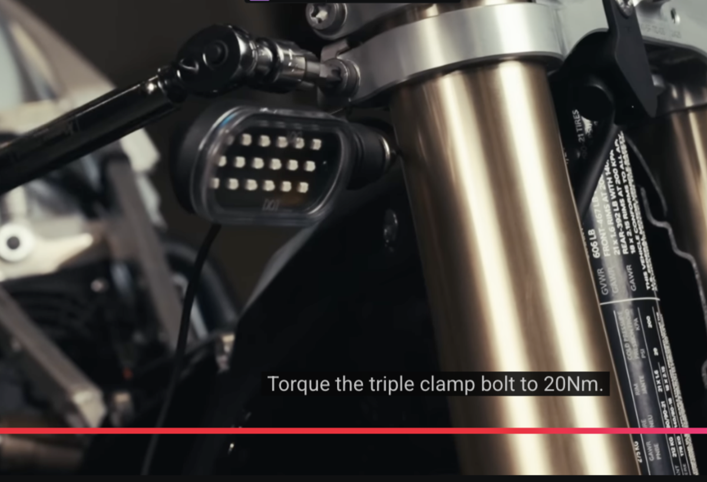
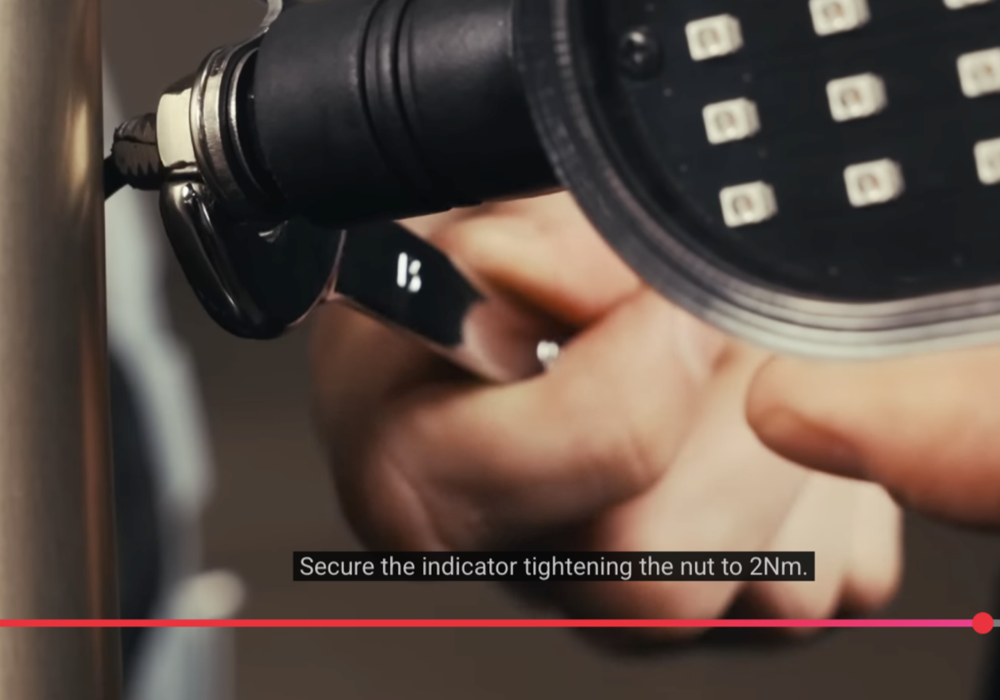
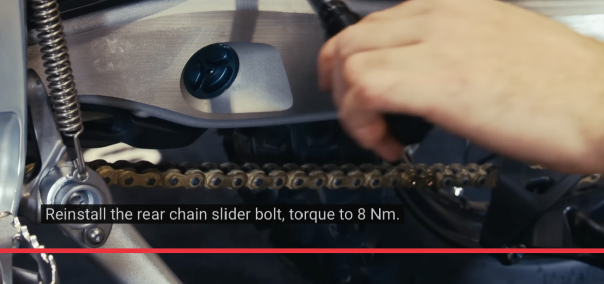
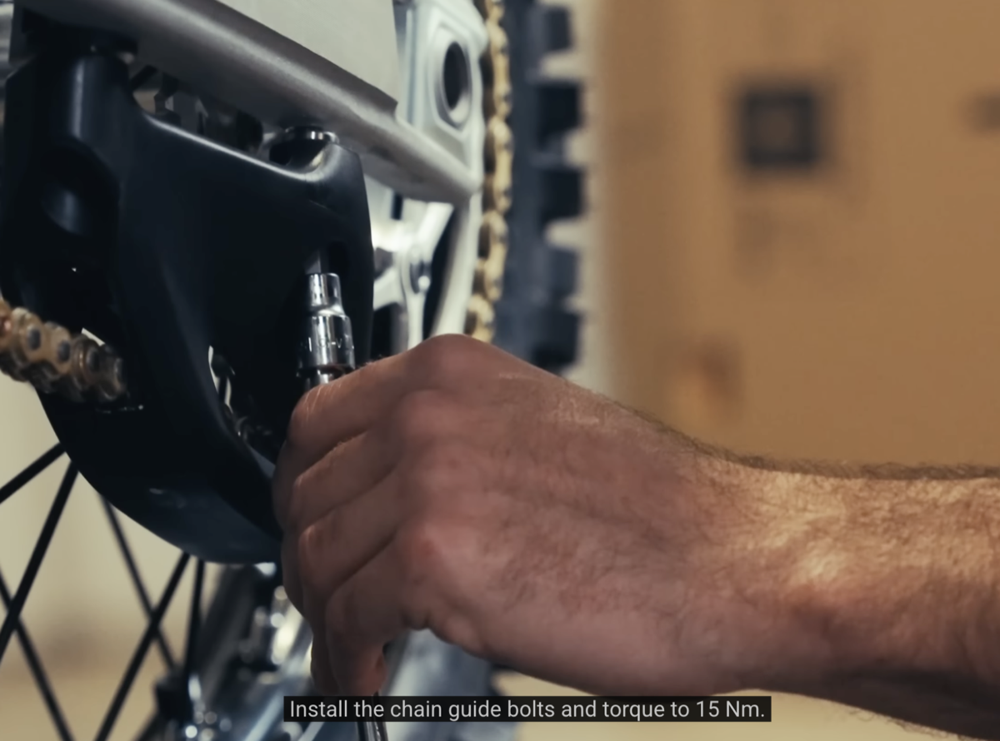

# Stark Varg EX Torque Specifications (UNOFFICIAL)

NOTE: This information may have errors. Always ensure torque specs are correct as per your bikes manual. This is
intended to be a more convenient form of the information but is not a substitute for checking your manual.

## Torque settings NOT found in manual

NOTE: These are not from the owner's manual. They are from Stark's official assembly videos, usually from subtitles or
on-screen captions. I am recording them because they are useful clues, not because I have independently verified that
they supersede the manual.

| Part                  | Fastener Type | Torque (Nm) | Source Evidence                                                                                                                          | Notes                                                                                                                                          |
| --------------------- | ------------- | ----------- | ---------------------------------------------------------------------------------------------------------------------------------------- | ---------------------------------------------------------------------------------------------------------------------------------------------- |
| **Triple clamp**      | bolt          | 20          | [Screenshot](assets/assembly_video_triple_clamp_bolt_spec.png), [Stark assembly video](https://www.youtube.com/watch?v=nBx43Dxl2og)      | Caption says: "Torque the triple clamp bolt to 20Nm."                                                                                          |
| **Indicator**         | nut           | 2           | [Screenshot](assets/assembly_video_indicator_nut_spec.png), [Stark assembly video](https://www.youtube.com/watch?v=nBx43Dxl2og)          | Caption says: "Secure the indicator tightening the nut to 2Nm."                                                                                |
| **Rear chain slider** | bolt          | 8           | [Screenshot](assets/assembly_video_rear_chain_slider_bolt_spec.png), [Stark assembly video](https://www.youtube.com/watch?v=nBx43Dxl2og) | Caption says: "Reinstall the rear chain slider bolt, torque to 8 Nm." This does not match the generic `Chain slider` `5 Nm` row in the manual. |
| **Rear chain guide**  | bolts         | 15          | [Screenshot](assets/assembly_video_chain_guide_bolt_spec.png), [Stark assembly video](https://www.youtube.com/watch?v=nBx43Dxl2og)       | Caption says: "Install the chain guide bolts and torque to 15 Nm."                                                                             |
| **Handlebar clamp**   | bolts         | 30          | [Screenshot](assets/assembly_video_clamp_bolt_spec.png), [Stark assembly video](https://www.youtube.com/watch?v=nBx43Dxl2og) subtitles   | The subtitle value appears to be `30 Nm`.                                                                                                      |

### Stark support on handlebar clamps

Stark refuses to give guidance here via support (as of December 2025). Prior to finding the assembly-video value, I had
been experimenting with 15 Nm, no locktite, and frequent inspections on the Titanium bolt kit. This is NOT a
recommendation and I believe it is too little and/or loctite is needed. I now have a different Stark and no longer have
the Titanium bolt kit installed, so for my own purposes I consider that experimenting superseded by the assembly-video
value in the table above. I would still be cautious about over-torquing if you do have the Titanium bolt kit.

The assembly-video `30 Nm` value is recorded in the table above.

## Torque settings found in manual

| Part                           | Fastener Type    | Torque (Nm) | Bit | Description & Location on Stark Varg EX                                                                                                                           |
| ------------------------------ | ---------------- | ----------- | --- | ----------------------------------------------------------------------------------------------------------------------------------------------------------------- |
| **Brake discs**                | bolts            | 14          | TBD | Rotor-to-hub bolts on front and rear wheels; 6 bolts per disc typically; Brembo brake system                                                                      |
| **Brake pedal**                | peg bolts        | 5           | TBD | Bolts securing the folding tip/peg portion of rear brake pedal; right side at rider foot position                                                                 |
| **Brake pedal**                | sway bolts       | 20          | TBD | Main pivot hardware allowing brake pedal rotation; mounts to frame right side                                                                                     |
| **Brake pedal**                | link bolts       | 10          | TBD | Linkage connecting brake pedal arm to rear master cylinder pushrod                                                                                                |
| **Carbon fiber spoiler**       | bolts            | 3           | TBD | Side panel accent pieces; Varg uses extensive carbon fiber bodywork—low torque critical to avoid cracking                                                         |
| **Chain slider**               | bolts            | 5           | TBD | UHMW plastic guide on swingarm underside; protects swingarm from chain contact and guides chain path                                                              |
| **Throttle clip**              | bolts            | 3           | TBD | Clamp securing throttle tube housing to right handlebar end                                                                                                       |
| **Control switch**             | bolt             | 2.5         | TBD | Left handlebar switch pod (power button, map selection +/- buttons); clamps to handlebar—the main interface for turning bike on/engaging/changing modes           |
| **Docking station**            | bolts            | 30          | TBD | Stark Phone docking cradle with wireless charging; mounted to upper frame/triple clamp area behind front number plate                                             |
| **Foot peg**                   | pin              | 20          | TBD | Pivot pins allowing pegs to fold on impact; both left and right side frame mounts; Varg uses wide MX-style pegs                                                   |
| **Fork brake line bracket**    | screws           | 5           | TBD | Small P-clamp style bracket on front fork leg (likely left leg); routes front brake hose along fork to prevent binding during compression                         |
| **Front fender**               | bolts            | 8           | TBD | Plastic front mudguard; mounts to fork legs or fork brace above front wheel                                                                                       |
| **Front brake caliper**        | bolts            | 25          | TBD | Brembo caliper mounting to left fork leg lower; two bolts; critical braking system fastener                                                                       |
| **Front number plate**         | bolt             | 5           | TBD | Front plastic shroud/number plate assembly; mounts ahead of docking station area                                                                                  |
| **Front wheel axle**           | lock bolt        | 35          | TBD | Pinch bolt on fork leg that locks axle in position after main axle is set; typically on right fork leg                                                            |
| **Front wheel axle**           | clamp bolts      | 15          | TBD | Fork leg axle clamp pinch bolts; squeeze fork lowers onto axle ends; both legs                                                                                    |
| **Foot brake master cylinder** | bolts            | 10          | TBD | Brembo rear brake master cylinder mount to frame; right side above/behind footpeg                                                                                 |
| **Hand brake master cylinder** | clamp bolts      | 6           | TBD | Brembo front brake master cylinder/lever assembly clamp to right handlebar                                                                                        |
| **Lower rear fender**          | bolts            | 5           | TBD | Lower portion of rear fender assembly; below seat, protects from roost off rear tire                                                                              |
| **Mud flap**                   | screws           | 3           | TBD | Flexible extension on rear fender; additional debris/mud protection for following riders                                                                          |
| **Pull rod**                   | nuts             | 60          | TBD | Rear suspension linkage connecting rod; links shock absorber to bell crank/rocker system; high-stress component                                                   |
| **Rear wheel axle**            | lock bolt        | 80          | TBD | Main rear axle nut; secures wheel, sprocket carrier, and chain adjusters; **highest torque spec on bike—critical safety fastener**                                |
| **Rear wheel sprocket**        | bolts            | 35          | TBD | Bolts attaching driven sprocket to rear hub carrier; all motor power transfers through these fasteners                                                            |
| **Rocker arm**                 | reverse lock nut | 20          | TBD | Jam/lock nut on suspension rocker pivot; prevents main hardware from backing out                                                                                  |
| **Rocker arm**                 | main shaft       | 60          | TBD | Primary pivot shaft for rear suspension bell crank/rocker; located at frame junction below battery/motor                                                          |
| **Rocker arm**                 | shaft lids       | 5           | TBD | Dust caps/covers for rocker arm pivot shaft ends; keep debris out of bearings                                                                                     |
| **Rocker arm**                 | lock nut         | 60          | TBD | Final locking nut securing main shaft assembly                                                                                                                    |
| **Shock**                      | top nut          | 40          | TBD | Upper shock mount; on Varg connects to frame or linkage above swingarm pivot area                                                                                 |
| **Shock**                      | bottom nut       | 40          | TBD | Lower shock mount connecting to rocker/linkage system                                                                                                             |
| **Side plates**                | top bolt         | 20          | TBD | Upper radiator shroud/side panel fasteners; cover battery and cooling system                                                                                      |
| **Side plates**                | bottom bolt      | 30          | TBD | Lower side panel mounts; bear more vibration load                                                                                                                 |
| **Side stand**                 | bracket bolts    | 20          | TBD | Kickstand mounting bracket to frame; left side of bike                                                                                                            |
| **Side stand**                 | leg bolt         | 35          | TBD | Main pivot bolt for kickstand leg; bears full bike weight when parked                                                                                             |
| **Skid plate**                 | bolts            | 15          | TBD | Protective bash plate under frame/battery area; shields battery pack and motor from rocks/impacts on rough terrain—important to protect expensive EV components   |
| **Spoiler assembly**           | rear center bolt | 10          | TBD | Center rear bodywork mount; the Varg's distinctive tail section                                                                                                   |
| **Spoiler assembly**           | side bolts       | 20          | TBD | Lateral mounting points for rear spoiler assembly                                                                                                                 |
| **Spoiler assembly**           | front bolts      | 5           | TBD | Forward attachment points where spoiler meets side panels                                                                                                         |
| **Swingarm**                   | axle             | 45          | TBD | Main swingarm pivot bolt at frame; allows rear suspension articulation; located behind/below motor                                                                |
| **Swingarm**                   | clamp bolt       | 25          | TBD | Pinch/clamp bolt securing swingarm pivot shaft position                                                                                                           |
| **Throttle**                   | bolt             | 2.5         | TBD | Internal throttle assembly fastener; Varg uses electronic twist throttle (no cable)                                                                               |
| **VCU**                        | side bolts       | 2           | TBD | Vehicle Control Unit (main motor controller/bike brain) side mounting points; very low torque—aluminum/plastic electronics enclosure; located in frame near motor |
| **VCU**                        | center bolts     | 5           | TBD | Central VCU mounting fasteners; slightly higher load than side mounts                                                                                             |

---
